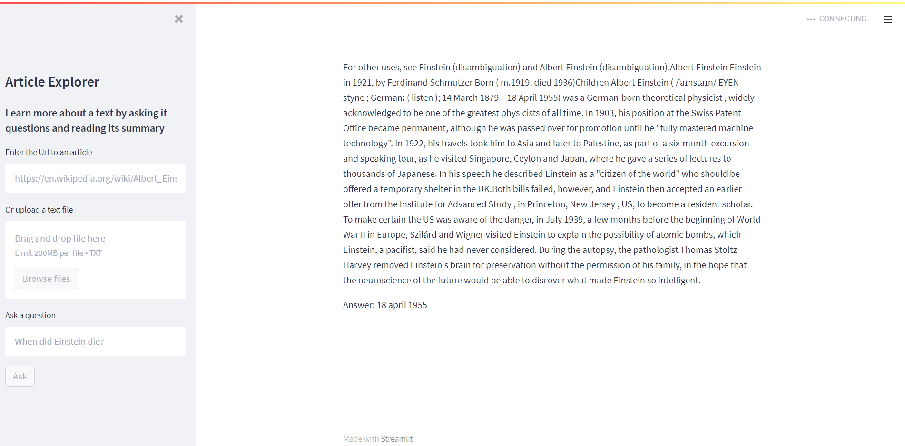

# Article Explorer
A system to learn and explore articles featuring automatic text summarization and a query dialog engine

This was created as the NLP Project for UNT Fall 2021 CSCE 4290/5290
by **Ali Khan, Kaitlynn Whitney, and Rachel Johnson**

## Introduction
The system features BERT-based neural models for extractive summarization as well as question answering on short and long documents.
Users can submit the url of an article on the internet, or upload a local ```.txt``` file.

N.B. First runs of the system will be slow due to downloading of language models.

## Installation
This application requires at least Python 3.7

Install dependencies with:
```
$ pip install -r requirements.txt
```

## Usage
Run either ```webapp.sh``` or ```python -m streamlit main.py```

It should start the streamlit server and will be running on your browser

Just enter the url of the article and the summary will pop up after processing after which you can query the text with the dialog engine.

Ex: https://en.wikipedia.org/wiki/Albert_Einstein 

'When did Einstein die?'


